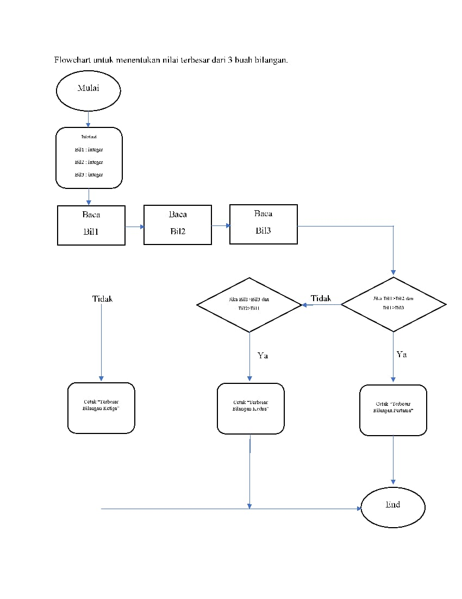
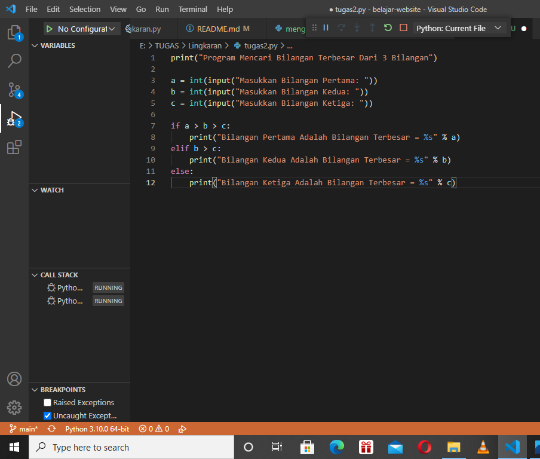
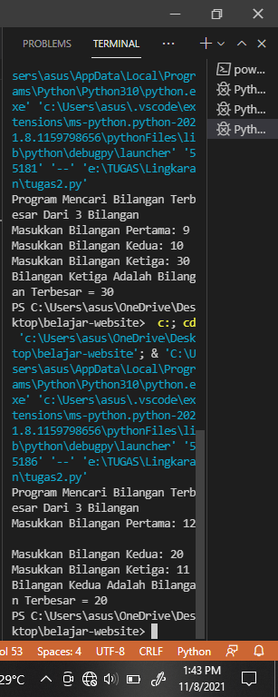
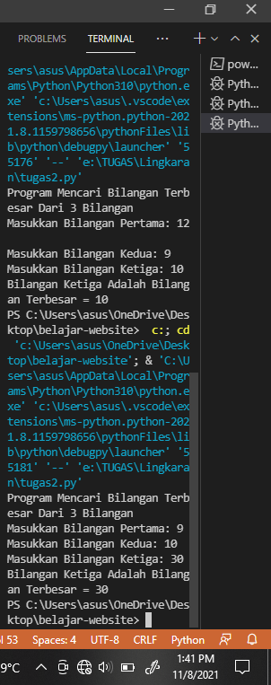
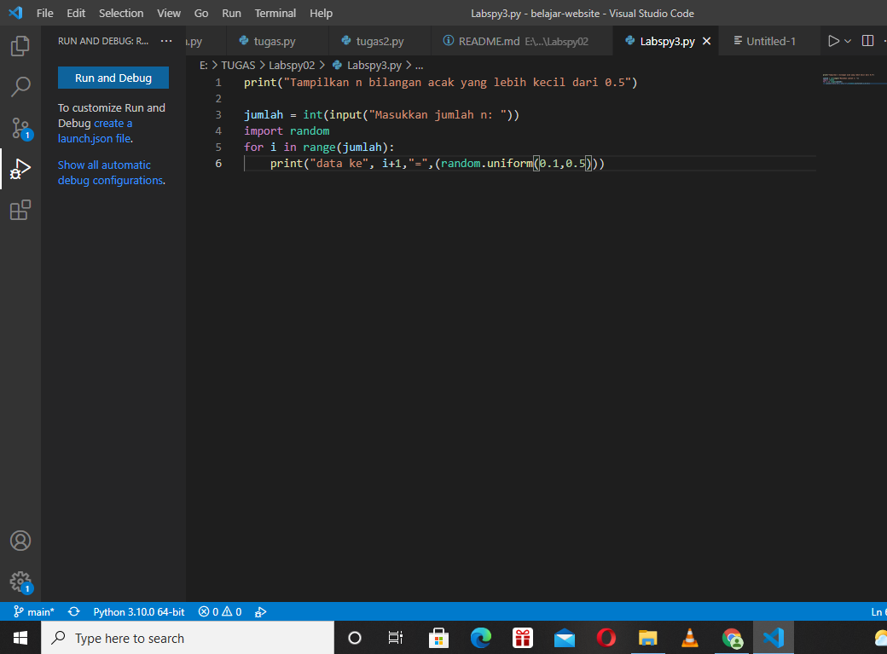
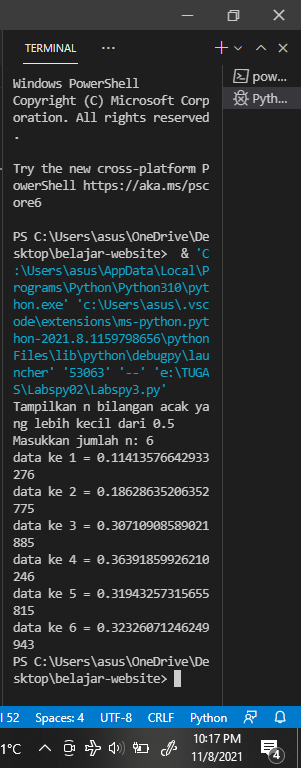
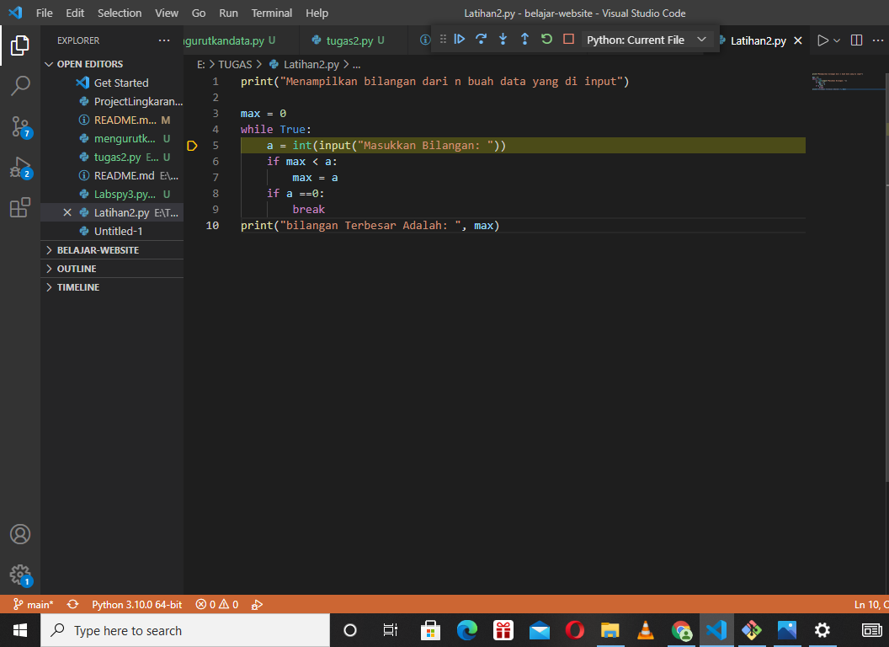
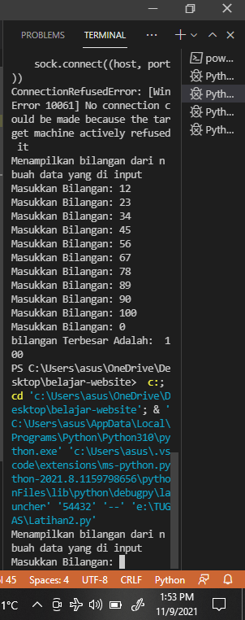
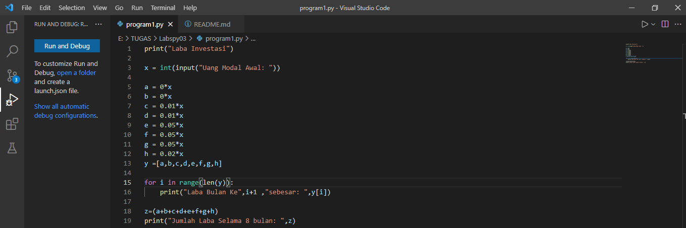
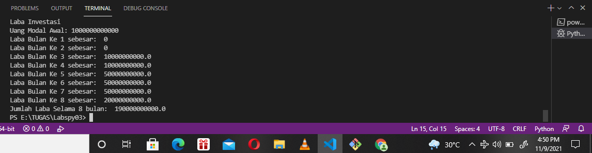

# Labspy02-03
# Labspy02
## FLOWCHART
### ini adalah flowchart untuk menentukan nilai terbesar dari 3 buah bilangan

### Menggunakan satatement if untuk mencari nilai terbesar dari 3 bilangan
### programnya adalah di bawah ini

### Untuk hasil ketika program di jalankan bilangan ke 2 yang terbesar

### Untuk hasil ketika program di jalankan bilangan ke 3 yang terbesar 

# Labspy03
## Latihan 1
## FLOWCHART lATIHAN 1
### berikut flowchart dari program latihan 1, untuk menampilkan n bilangan acak yang lebih kecil dari 0.5

### Penjelasan alur program
### print("Tampilkan n bilangan acak yang lebih kecil dari 0.5") - adalah perintah untuk menampilkan judulnya.
### jumlah = int(input("Masukkan jumlah n: ")) - adalah perintah untuk menginput nilai n tersebut
### import random - adalah perintah untuk mengimport built-in random yang telah tersedia di python
### for i in range(jumlah): - adalah perintah untuk i sebagai integer dalam baris jumlah
### print("data ke", i+1,"=",(random.uniform(0.1,0.5))) - adalah perintah untuk menampilkan hasil yang telah di input dengan ketentuan random uniform mulai dari nilai 0.1 sampai 0.5
### berikut gambaran programnya

### Untuk hasil dari program diatas ketika di jalankan 

## Latihan 2
## FLOWCHART LATIHAN 2
### Berikut flowchart untuk program menampilkan bilangan tersbesar dari n buah data yang diinputkan

### penjelasan alur program
### print("Menampilkan bilangan terbesar dari n buah data yang diinput") - adalah perintah untuk menampilkan judul program
### max = 0 - adalah perintah untuk menampilkan nilai max yang adalah 0
### while True: - adalah perintah untuk pengulangan hingga waktu yang tidak ditentukan
### a = int(input("Masukkan Bilangan: ")) - adalah perintah untuk menginput nilai integer
### if max < a: - adalah perintah untuk tipe data if atau jika, maksimal nilai lebih kecil dari a atau integer
### max = a - perintah untuk nilai maximal sama dengan a atau integer
### if a ==0: - perintah untuk tipe data if atau jika a sama dengan 0 maka
### break - perintah untuk mengakhiri pengulangan, jadi jika menginput nilai 0 maka pengulangan berakhir atau selesai
### print("Bilangan Terbesar Adalah: ", max) - adalah perintah untuk menampilkan hasil bilangan yang terbesar dari angka-angka yang telah terinput
### berikut gambaran programnya

### Berikut hasil program saat di jalankan

## Praktikum 
## Program untuk menghitung laba investasi
### Berikut adalah flowchart dari program menghitung laba investasi

### Penjelasan alur program
### print("Laba Investasi") - adalah untuk menampilkan judul
### x = int(input("Uang Modal Awal: ")) - adalah untuk menginput nilai x sebagai modal awal
### a = 0*x - a adalah bulan pertama, karena bulan pertama belum memiliki laba, jadi masih 0 dikali dengan x nilai uang modal awal
### b = 0*x - b adalah bulan kedua, karena bulan kedua belum memiliki laba, jadi nilai x dari uang modal dikali dengan 0
### c = 0.01*x - c adalah bulan ketiga, dan sudah memiliki laba 1%, jadi ditulis 0.01 bentuk sederhana dari 1% dikali dengan modal atau uang awal dengan nilai x
### d = 0.01*x - d adalah bulan keempat, dan labanya 1%, jadi ditulis 0.01 dikalikan dengan nilai x yang adalah uang awal atau modal
### e = 0.05*x - e adalah bulan kelima, dan laba pada bulan kelima sebesar 5%, maka ditulis 0.05 dikalikan dengan nilai x untuk nilai uang awal atau modal
### f = 0.05*x - f adalah bulan keenam, dan laba pada bulan keenam sebesar 5%, maka ditulis 0.05 dikalikan dengan nilai x untuk nilai uang awal atau modal
### g = 0.05*x - g adalah bulan ketujuh, dan laba pada bulan ketujuh sebesar 5%, maka ditulis 0.05 dikalikan dengan nilai x untuk nilai uang awal atau modal
### h = 0.02*x - h adalah bulan kedelapan, dan laba pada bulan kedelapan sebesar 2%, maka ditulis 0.02 dikalikan dengan nilai x untuk nilai uang awal atau modal
### y=[a,b,c,d,e,f,g,h] - adalah untuk menentukan syarat y yang berisi a,b,c,d,e,f,g,h
### for i in range(len(y)): - adalah untuk perulangan data dengan isi data y, dengan menampilkan urutan laba perbulan sesuai range yang di tentukan dengan hasil ke urutan yang diinputkan dari data y
### print("Laba Bulan Ke",i+1 ,"sebesar: ",y[i]) - untuk menampilkan hasil laba dari bulan ke 1 sampai terakhir
### z=(a+b+c+d+e+f+g+h) - Z untuk data yang berisi hasil penjumlahan laba dari bulan pertama sampai bulan ke delapan
### print("Jumlah Laba Selama 8 Bulan: ",z) - menampilkan hasil dari jumlah laba
### berikut gambaran programnya

### Berikut adalah hasil ketika program dijalankan
